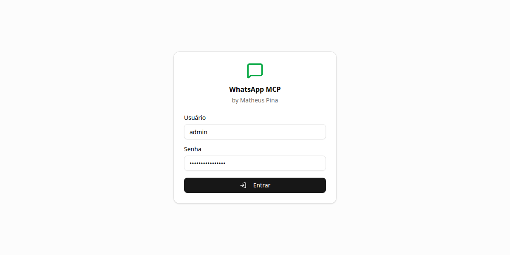
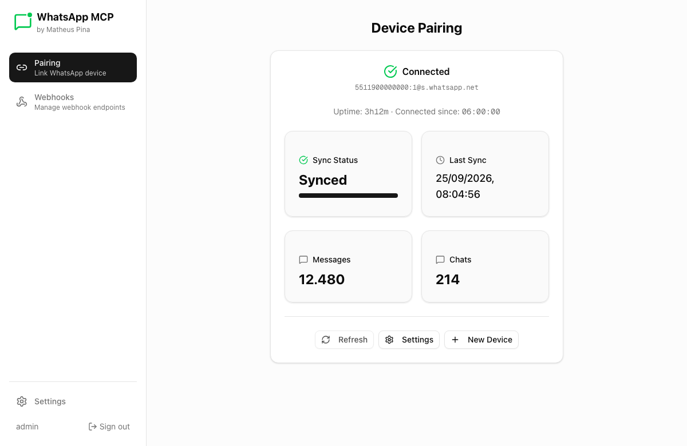
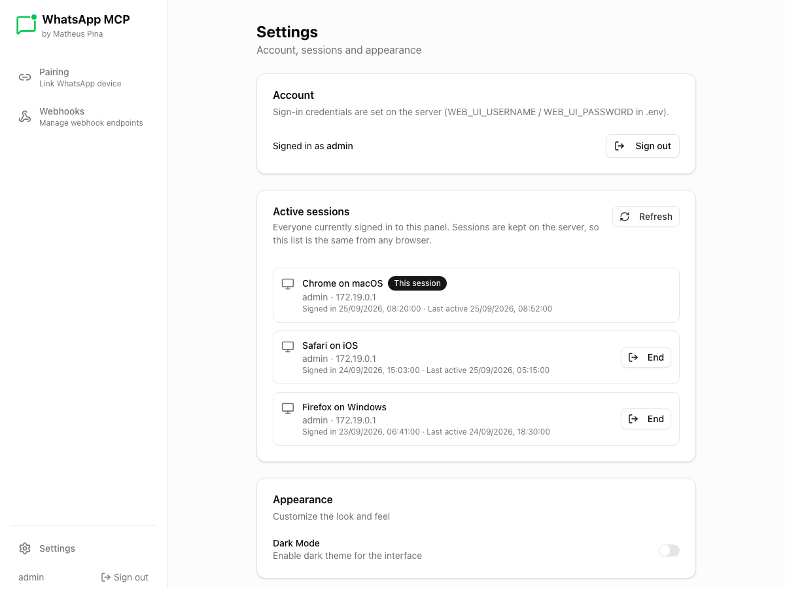
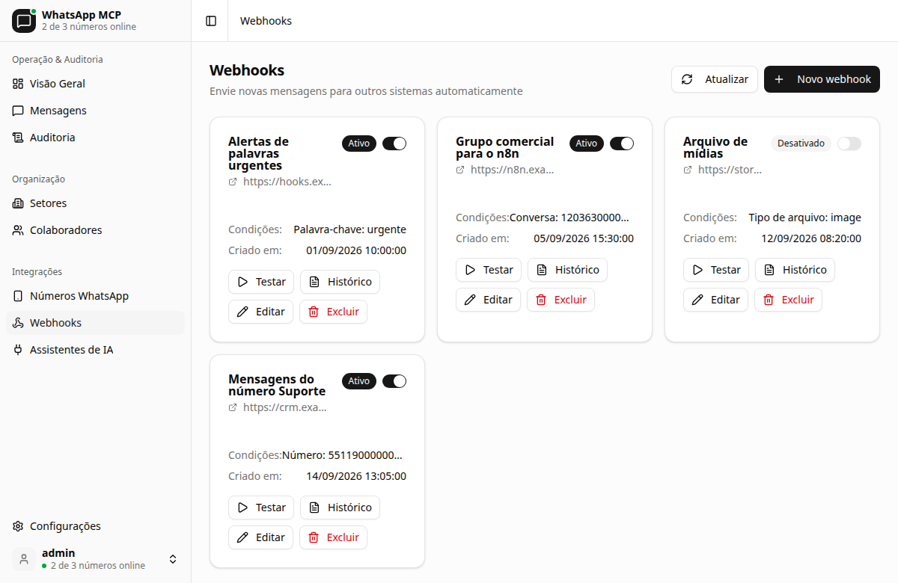
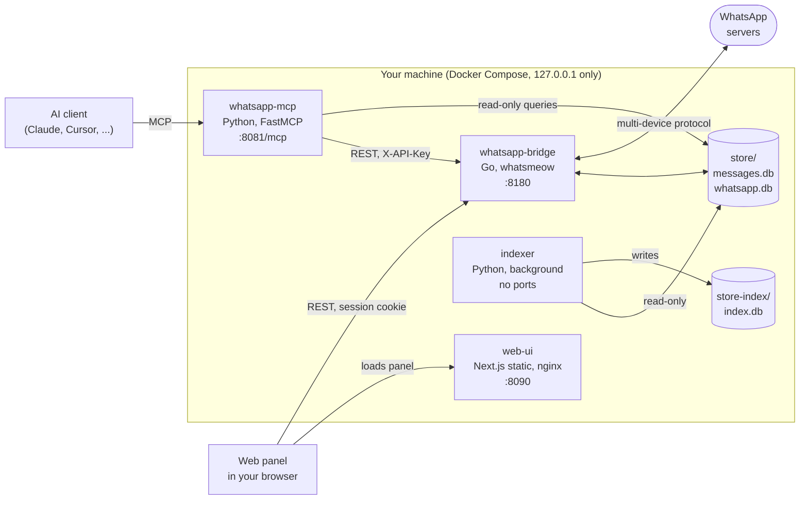

<div align="center">


# WhatsApp MCP

**Give your AI assistant local, controlled access to your WhatsApp: read, search and, if you allow it, send, through the Model Context Protocol.**

by [Matheus Pina](https://github.com/matheuspina)

[](LICENSE)
[](COMMERCIAL.md)
[](https://github.com/matheuspina/whatsapp-mcp/actions/workflows/go-test.yml)
[](https://github.com/matheuspina/whatsapp-mcp/actions/workflows/python-test.yml)
[](https://github.com/matheuspina/whatsapp-mcp/actions/workflows/lint.yml)
[](https://github.com/matheuspina/whatsapp-mcp/actions/workflows/security.yml)


[](https://github.com/matheuspina/whatsapp-mcp/commits/main)
[](https://github.com/matheuspina/whatsapp-mcp/issues)
[](https://github.com/matheuspina/whatsapp-mcp/stargazers)

[Quick start](#quick-start) ·
[Features](#features) ·
[Connect your AI client](#connect-your-ai-client) ·
[Tools](#mcp-tools) ·
[Documentation](docs/README.md) ·
[Security](SECURITY.md) ·
[Commercial use](#license-and-commercial-use)

</div>

> [!IMPORTANT]
> **Free for noncommercial use. Commercial use requires a license.**
> To use this project in a business, for a client, or in a product or service, contact **[mathpinab@gmail.com](mailto:mathpinab@gmail.com)**.
> See [License and commercial use](#license-and-commercial-use).

> [!WARNING]
> This project uses the **unofficial** WhatsApp Web protocol. It is not affiliated with WhatsApp or Meta, it can put your account at risk,
> and an AI agent connected to it can read and send your private messages. Read the [Disclaimer](#disclaimer) and [SECURITY.md](SECURITY.md) first.

---

## Table of contents

- [Overview](#overview)
- [Features](#features)
- [Screenshots](#screenshots)
- [Architecture](#architecture)
- [Quick start](#quick-start)
- [Connect your AI client](#connect-your-ai-client)
- [MCP tools](#mcp-tools)
- [Web panel](#web-panel)
- [Configuration](#configuration)
- [Security and privacy](#security-and-privacy)
- [Troubleshooting](#troubleshooting)
- [Development](#development)
- [Roadmap](#roadmap)
- [Contributing](#contributing)
- [License and commercial use](#license-and-commercial-use)
- [Disclaimer](#disclaimer)
- [Acknowledgements](#acknowledgements)

## Overview

WhatsApp MCP links to your WhatsApp account the same way WhatsApp Web does (as a linked device, paired with a code) and exposes it as
[Model Context Protocol](https://modelcontextprotocol.io) tools. Any MCP-capable assistant, such as Claude, can then do things like:

> *"Summarize what was said in the Family group since yesterday."*
> *"Find the last message where Ana mentioned the invoice, and show me the messages around it."*
> *"Reply to Carlos that I will be there at 6."*
> *"Download the PDF from the message Marina sent this morning."*

Everything runs **on your own machine** in Docker containers. Your messages are stored in local SQLite files and are not sent to any
server of this project. (Text the assistant reads through a tool does reach your AI provider, as with any tool result. See
[Security and privacy](#security-and-privacy).)

## Features

- **Read and search.** List chats and contacts, read messages with filters, get the messages around a hit, resolve contact names.
- **Send.** Text with replies and quotes, files, voice notes, reactions and polls, with an optional recipient allowlist.
- **Manage.** Edit and delete messages, mark as read, manage groups, nicknames, presence, the blocklist and newsletters.
- **History.** Choose how far back to sync when pairing, and request older messages of a single chat on demand.
- **Media.** Download images, video, audio and documents, with images returned inline to the assistant.
- **Webhooks.** Forward incoming messages to HTTP endpoints, with triggers, matching rules, HMAC signatures and retries.
- **Web panel.** Sign in, pair a device with a phone code, watch sync status, see and end active sessions, manage webhooks.
- **Local search index (in progress).** A background service builds a keyword-searchable index (SQLite FTS5) of your message history, entirely on your machine, as the foundation for local hybrid search. Not yet exposed as an MCP tool. See [docs/search.md](docs/search.md).
- **A tool surface you control.** 27 tools in 10 toolsets; expose only what your assistant needs.
- **Secure by default.** Ports on `127.0.0.1` only, API key and login required, HttpOnly session cookies, CSRF and brute-force protection.
- **Docker first.** One command starts everything; state lives in a single `store/` folder.

## Screenshots

<table>
  <tr>
    <td width="50%"><br><sub><b>Sign in</b> with the username and password from your <code>.env</code></sub></td>
    <td width="50%"><br><sub><b>Pairing and sync status</b></sub></td>
  </tr>
  <tr>
    <td width="50%"><br><sub><b>Active sessions</b>, kept on the server and visible from any browser</sub></td>
    <td width="50%"><br><sub><b>Webhook manager</b></sub></td>
  </tr>
</table>

<sub>Screenshots use invented data.</sub>

## Architecture



| Component | Stack | Role |
|-----------|-------|------|
| [`whatsapp-bridge`](whatsapp-bridge) | Go, [whatsmeow](https://github.com/tulir/whatsmeow), SQLite | Talks to WhatsApp, stores messages, REST API, webhooks, panel sessions |
| [`whatsapp-mcp-server`](whatsapp-mcp-server) | Python, FastMCP | MCP tools for your AI client |
| [`whatsapp-mcp-server/search`](whatsapp-mcp-server/search) | Python, background service | Keyword search index (`store-index/index.db`); read-only against `store/`. Phase 1 of local hybrid search |
| [`whatsapp-web-ui`](whatsapp-web-ui) | Next.js, Tailwind, shadcn/ui | Web panel |

More in [docs/architecture.md](docs/architecture.md) and [docs/search.md](docs/search.md).

## Quick start

### Requirements

- Docker with **Compose 2.24 or later** (Docker Desktop includes it)
- A phone with WhatsApp, on Wi-Fi and charging during the first sync
- About 2 GB of free disk for the Docker images and build cache, plus room for your message history

### 1. Get the code and configure it

```bash
git clone https://github.com/matheuspina/whatsapp-mcp.git
cd whatsapp-mcp
cp .env.example .env
```

Open `.env` and set three values. Generate strong ones:

```bash
openssl rand -hex 32      # API_KEY
openssl rand -base64 18   # WEB_UI_PASSWORD
```

| Variable | What it is |
|----------|------------|
| `API_KEY` | Secret for the bridge API. Used by the MCP server and scripts |
| `WEB_UI_USERNAME` | Username for the web panel |
| `WEB_UI_PASSWORD` | Password for the web panel |

Optionally set `HISTORY_SYNC_DAYS_LIMIT` (default `365`) **before pairing**: it only takes effect when a device is linked.

```bash
chmod 600 .env            # it holds secrets; it is git-ignored
```

### 2. Start it

```bash
docker compose up -d --build
```

The first build takes a few minutes. Check that everything is healthy:

```bash
docker compose ps
```

### 3. Pair your WhatsApp

1. Open **<http://127.0.0.1:8090>** and sign in.
2. Go to **Pairing**, enter your number with country code and no `+` or spaces (for example `5511999999999`), and click **Generate Code**.
3. On your phone: **WhatsApp → Settings → Linked devices → Link a device → Link with phone number instead**, then type the 8-character code.
4. Keep the phone online until the panel shows **Synced** and the message count stops growing.

You can also pair from a terminal with `make pair PHONE=5511999999999`, or scan the QR code that the bridge prints in
`docker compose logs -f whatsapp-bridge`.

### 4. Connect your AI client

Continue with [Connect your AI client](#connect-your-ai-client).

## Connect your AI client

The MCP server listens on **`http://127.0.0.1:8081/mcp`** (streamable HTTP).

> [!TIP]
> Keep **manual approval on** for the tools that send or change things (`send_message`, `send_file`, `delete_message`, `manage_group`, and so on),
> and use [`WHATSAPP_MCP_TOOLSETS`](#choose-your-toolsets) to expose only what the assistant needs.

<details open>
<summary><b>Claude Code</b></summary>

```bash
claude mcp add --transport http whatsapp http://127.0.0.1:8081/mcp
```

</details>

<details>
<summary><b>Cursor and other clients that speak HTTP</b></summary>

```json
{
  "mcpServers": {
    "whatsapp": {
      "url": "http://127.0.0.1:8081/mcp"
    }
  }
}
```

</details>

<details>
<summary><b>Claude Desktop and other stdio-only clients</b></summary>

These clients start the server themselves. It runs on your host, so you need [uv](https://docs.astral.sh/uv/) installed, and it reads
the same `store/` folder. Add this to `claude_desktop_config.json`, with your real paths:

```json
{
  "mcpServers": {
    "whatsapp": {
      "command": "uv",
      "args": ["run", "--directory", "/path/to/whatsapp-mcp/whatsapp-mcp-server", "python", "main.py"],
      "env": {
        "WA_STORE_PATH": "/path/to/whatsapp-mcp/store",
        "BRIDGE_HOST": "127.0.0.1:8180"
      }
    }
  }
}
```

`API_KEY` is read from the `.env` file in the repository root.

</details>

### Choose your toolsets

By default every toolset is enabled. To expose fewer tools, set `WHATSAPP_MCP_TOOLSETS` in `.env`, then `docker compose up -d`:

```bash
WHATSAPP_MCP_TOOLSETS=core                 # read-only: chats, messages, contacts
WHATSAPP_MCP_TOOLSETS=core,send,media      # read, send and media (16 tools)
WHATSAPP_MCP_TOOLS=manage_group            # add single tools by name
```

To restrict who the bridge can message, set `WHATSAPP_ALLOWLIST_JIDS=5511999999999,120363000000000000@g.us`.

## MCP tools

27 tools in 10 toolsets. Read-only tools are marked <kbd>read</kbd>, tools that change or send things <kbd>write</kbd>, and destructive ones <kbd>destructive</kbd>.

| Toolset | Tool | Description |
|---------|------|-------------|
| `core` | `list_chats` <kbd>read</kbd> | List chats, sorted by activity or name |
| `core` | `get_chat` <kbd>read</kbd> | Metadata of one chat by JID |
| `core` | `list_messages` <kbd>read</kbd> | Search and filter messages, optionally with surrounding context |
| `core` | `get_message_context` <kbd>read</kbd> | Messages before and after a given message |
| `core` | `search_contacts` <kbd>read</kbd> | Find contacts by name or number |
| `core` | `list_all_contacts` <kbd>read</kbd> | List all contacts |
| `core` | `get_contact_context` <kbd>read</kbd> | Contact details, related chats and last interaction in one call |
| `core` | `get_direct_chat_by_contact` <kbd>read</kbd> | Find the one-to-one chat for a phone number |
| `core` | `get_group_info` <kbd>read</kbd> | Group name, topic and participants |
| `core` | `get_profile_picture` <kbd>read</kbd> | Profile picture URL for a user or group |
| `send` | `send_message` <kbd>write</kbd> | Send text, with optional replies (`quoted_message_id`) and mentions |
| `send` | `send_reaction` <kbd>write</kbd> | React to a message with an emoji |
| `send` | `create_poll` <kbd>write</kbd> | Send a poll |
| `media` | `send_file` <kbd>write</kbd> | Send an image, video or document (from a server path or base64) |
| `media` | `send_audio_message` <kbd>write</kbd> | Send a voice note |
| `media` | `download_media` <kbd>read</kbd> | Download media from a message; images are also returned inline |
| `history` | `request_history` <kbd>write</kbd> | Ask the phone for older messages of a chat |
| `message_admin` | `edit_message` <kbd>write</kbd> | Edit a message you sent |
| `message_admin` | `delete_message` <kbd>destructive</kbd> | Delete (revoke) a message |
| `message_admin` | `mark_read` <kbd>write</kbd> | Mark messages as read, or as played for voice notes |
| `contacts_write` | `manage_nickname` <kbd>write</kbd> | Set, get, remove or list local nicknames |
| `groups` | `manage_group` <kbd>destructive</kbd> | Create, update, leave, and manage members and admins |
| `presence` | `set_presence` <kbd>write</kbd> | Set yourself online or offline |
| `presence` | `subscribe_presence` <kbd>write</kbd> | Subscribe to a contact's presence |
| `account_admin` | `get_blocklist` <kbd>read</kbd> | List blocked users |
| `account_admin` | `manage_blocklist` <kbd>destructive</kbd> | Block or unblock users |
| `newsletter` | `manage_newsletter` <kbd>destructive</kbd> | Follow, unfollow or create channels |

Tool responses carry raw, complete data (senders, timestamps, quoted messages, media info) and leave the interpretation to the assistant.
See [docs/response-design.md](docs/response-design.md).

## Web panel

Open **<http://127.0.0.1:8090>**. Sign in with `WEB_UI_USERNAME` and `WEB_UI_PASSWORD`.

- **Pairing:** link a device with a phone code, and watch connection and sync status.
- **Settings:** account, **active sessions** (who is signed in, from which browser; end any of them) and appearance.
- **Webhooks:** create, test, enable and inspect webhooks.

Sessions are stored on the server and the browser holds only an `HttpOnly` cookie, so nothing sensitive sits in the browser's storage.
See [docs/authentication.md](docs/authentication.md).

## Configuration

Everything is configured through environment variables in `.env`. The essentials:

| Variable | Default | Description |
|----------|---------|-------------|
| `API_KEY` | *(required)* | Secret for the bridge API |
| `WEB_UI_USERNAME`, `WEB_UI_PASSWORD` | *(required)* | Web panel login |
| `WEB_UI_SESSION_TTL` | `24h` | Panel session inactivity timeout |
| `HISTORY_SYNC_DAYS_LIMIT` | `365` | Days of history to request when pairing |
| `WHATSAPP_MCP_TOOLSETS` | `all` | Which toolsets to expose |
| `WHATSAPP_ALLOWLIST_JIDS` | *(none)* | Only allow sending to these numbers or JIDs |
| `ANTIBAN_ENABLED` | `false` | Human-like send delays and warm-up ramp |

The full reference, with every variable and the ports, is in [docs/configuration.md](docs/configuration.md).

| Service | Address |
|---------|---------|
| Web panel | `http://127.0.0.1:8090` |
| MCP server | `http://127.0.0.1:8081/mcp` |
| Bridge API | `http://127.0.0.1:8180` |

### Everyday commands

```bash
docker compose up -d --build     # start, or rebuild after changes
docker compose logs -f whatsapp-bridge
docker compose logs -f indexer   # search index build/backfill progress
docker compose down              # stop (your data stays in ./store)
make status                      # connection state
make reconnect                   # reconnect without pairing again
```

Run `make help` for the rest.

## Security and privacy

- **Local first.** Ports are published on `127.0.0.1` only. Messages and the WhatsApp session live in `./store` on your machine.
- **Authenticated.** The bridge API needs an API key or a panel session; the panel uses `HttpOnly`, `SameSite=Strict` cookies, CSRF checks and login throttling.
- **The assistant sees what it reads.** When a tool returns messages, that text is sent to your AI provider as part of the conversation. Use narrow toolsets, and do not connect this to an assistant you do not trust with that data.
- **Prompt injection is real.** Anyone who can message you can put text in front of your assistant. Keep approval on for write tools.
- **The MCP endpoint has no login.** It is reachable only from your machine, but any local program can use it. See the [known limitations](SECURITY.md#known-limitations).
- **Your data is not encrypted at rest.** Use full-disk encryption and never share or commit `store/` or `.env`.

Read the full [security policy](SECURITY.md) and its [hardening checklist](SECURITY.md#hardening-checklist).

## Troubleshooting

<details>
<summary><b>The panel says it cannot reach the bridge</b></summary>

```bash
docker compose ps
docker compose logs --tail 50 whatsapp-bridge
curl http://127.0.0.1:8180/api/health
```

`/api/health` reports `connected` and `needs_pairing`.

</details>

<details>
<summary><b>I need to pair again, or WhatsApp shows the device as logged out</b></summary>

WhatsApp ends the link if the phone stays offline for more than about 14 days, if you unlink it under *Linked devices*, or if it detects suspicious behaviour.
Check `make status`: `needs_pairing: true` means you must pair again from the panel or with `make pair PHONE=...`.

</details>

<details>
<summary><b>I want more (or less) history</b></summary>

`HISTORY_SYNC_DAYS_LIMIT` only applies while pairing. To change it, unlink the device on your phone, delete `store/whatsapp.db`, set the new value and pair again.
WhatsApp decides what it sends, so the number is a request, not a guarantee. For one chat you can ask for older messages with the `request_history` tool.
See [docs/history-sync.md](docs/history-sync.md).

</details>

<details>
<summary><b>Messages show a single tick or do not deliver</b></summary>

```bash
docker compose restart whatsapp-bridge
docker compose logs --tail 10 whatsapp-bridge      # look for "Connected to WhatsApp"
```

</details>

<details>
<summary><b>The bridge crashes with <code>SIGBUS</code> right after first start on macOS</b></summary>

This can happen once on Docker Desktop while the database files are first created on the bind mount. The container restarts by itself and runs normally afterwards.

</details>

<details>
<summary><b>The web panel keeps sending me to the sign-in page</b></summary>

Sessions are held in memory and end when the bridge restarts or after `WEB_UI_SESSION_TTL` without use. Sign in again. If sign-in fails, check the username and
password in `.env`; after five failures you must wait a few minutes.

</details>

## Development

```bash
# Bridge (Go 1.25+)
cd whatsapp-bridge && go test -race ./...

# MCP server (Python 3.11+, uv)
cd whatsapp-mcp-server && uv sync --all-extras && uv run python check.py && uv run pytest

# Web panel (Node 20+)
cd whatsapp-web-ui && npm ci && npm run dev
```

Code is copied into the images, so after a change rebuild the service: `docker compose up -d --build <service>`.
Details, code style and how to add a tool are in [CONTRIBUTING.md](CONTRIBUTING.md).

## Roadmap

Local hybrid search is underway: the background indexer and keyword search (FTS5) are in place ([docs/search.md](docs/search.md)); local embeddings and MCP search tools are next.
Also next up: authentication for the MCP endpoint and persistent panel sessions.
See [ROADMAP.md](ROADMAP.md) and the [changelog](CHANGELOG.md).

## Contributing

Bug reports, ideas and pull requests are welcome. Please read [CONTRIBUTING.md](CONTRIBUTING.md) and the [Code of Conduct](CODE_OF_CONDUCT.md).
Report security problems privately, following [SECURITY.md](SECURITY.md).

## License and commercial use

This project is **source-available**, not open source. It is licensed under the
[**PolyForm Noncommercial License 1.0.0**](LICENSE).

| You want to... | Do you need a license? |
|----------------|------------------------|
| Use it for yourself, at home, for hobby projects, study or research | **No.** Free under the license |
| Use it in a charity, school, university, public research body or government institution | **No.** Free under the license |
| Use it inside a company, or for a client | **Yes.** Commercial license required |
| Offer it, or something built on it, as a product or service | **Yes.** Commercial license required |
| Bundle it in a commercial product | **Yes.** Commercial license required |

> **Want to use WhatsApp MCP commercially? Get in touch:**
> **Matheus Pina, [mathpinab@gmail.com](mailto:mathpinab@gmail.com)**
> Tell me who you are, what you want to build and roughly how many users or accounts it will serve.

More in [COMMERCIAL.md](COMMERCIAL.md).

Part of this codebase descends from MIT-licensed projects, and their notices are preserved. See [NOTICE.md](NOTICE.md) for which terms cover what.

## Disclaimer

- **Not affiliated.** This project is independent. It is not affiliated with, endorsed by or sponsored by WhatsApp or Meta Platforms, Inc. WhatsApp is a trademark of Meta.
- **Unofficial protocol.** It uses the WhatsApp Web protocol without WhatsApp's permission. That may violate WhatsApp's Terms of Service, and WhatsApp can limit or **ban accounts** that use unofficial clients. Read-only use lowers the risk but does not remove it. For business messaging, use the official [WhatsApp Business Platform](https://developers.facebook.com/docs/whatsapp/cloud-api).
- **Your responsibility.** You are responsible for how you use it: for consent of the people whose messages you process, for privacy laws that apply to you (such as the GDPR or the LGPD), and for what your AI assistant does with its access. Do not use it for spam, bulk or unsolicited messaging, harassment, or surveillance.
- **No warranty.** The software is provided "as is", without warranty of any kind, and the author is not liable for any damage, data loss, account restriction or other consequence of using it. See the [LICENSE](LICENSE).
- **AI can be wrong.** An assistant may misread messages or take an action you did not intend. Review what it does, especially before it sends or deletes anything.

## Acknowledgements

WhatsApp MCP builds on [whatsmeow](https://github.com/tulir/whatsmeow) and on a chain of open source projects:
[lharries/whatsapp-mcp](https://github.com/lharries/whatsapp-mcp), [AdamRussak/whatsapp-mcp](https://github.com/AdamRussak/whatsapp-mcp)
and [FelixIsaac/whatsapp-mcp-extended](https://github.com/FelixIsaac/whatsapp-mcp-extended), plus ideas and fixes from many community forks.
Full credits are in [ACKNOWLEDGEMENTS.md](ACKNOWLEDGEMENTS.md), and license details in [NOTICE.md](NOTICE.md).

<div align="center">

<sub>Copyright © 2026 Matheus Pina · [PolyForm Noncommercial 1.0.0](LICENSE) · Commercial licensing: <a href="mailto:mathpinab@gmail.com">mathpinab@gmail.com</a></sub>

</div>
