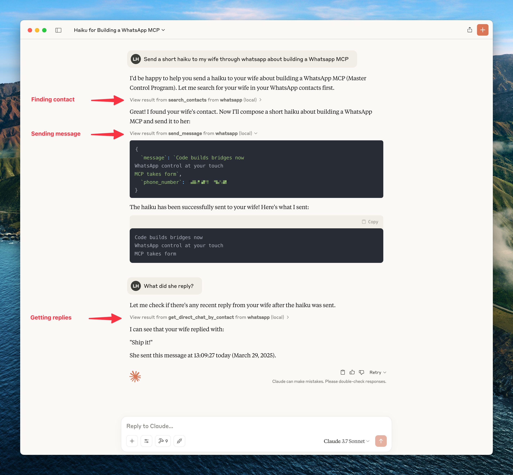

# WhatsApp MCP Extended

An extended Model Context Protocol (MCP) server for WhatsApp with a toolset-gated, agent-facing surface for messaging, search, media, group management, webhooks, presence, and more.

> Built on [AdamRussak/whatsapp-mcp](https://github.com/AdamRussak/whatsapp-mcp) (webhooks, containers) which forked [lharries/whatsapp-mcp](https://github.com/lharries/whatsapp-mcp) (original). Extended with reactions, message editing, polls, group management, presence, newsletters, and more.



## What's New (vs Original)

| Feature | Original | Extended |
|---------|----------|----------|
| MCP Tools | 12 | **26 default / 15 lean** |
| Reactions | - | ✅ |
| Edit/Delete Messages | - | ✅ |
| Group Management | - | ✅ |
| Polls | - | ✅ |
| History Sync | - | ✅ |
| Presence/Online Status | - | ✅ |
| Newsletters | - | ✅ |
| Webhooks | - | ✅ |
| Custom Nicknames | - | ✅ |

## Architecture

```
┌─────────────────────┐     ┌─────────────────────┐     ┌─────────────────────┐
│   whatsapp-bridge   │     │   whatsapp-mcp      │     │   whatsapp-web-ui   │
│   (Go + whatsmeow)  │◄────│   (Python + MCP)    │     │   (HTML/JS SPA)     │
│   Port: 8080        │     │   Port: 8081        │     │   Port: 8090        │
└─────────────────────┘     └─────────────────────┘     └─────────────────────┘
         │                           │
         ▼                           ▼
    ┌─────────────────────────────────────┐
    │           SQLite (store/)           │
    │  messages.db │ whatsapp.db          │
    └─────────────────────────────────────┘
```

## Quick Start

### Docker (Recommended)

```bash
git clone https://github.com/felixisaac/whatsapp-mcp-extended
cd whatsapp-mcp-extended

docker network create n8n_n8n_traefik_network
docker-compose up -d

# Scan QR code to authenticate
docker-compose logs -f whatsapp-bridge
```

### Claude Desktop / Cursor Integration

Add to your MCP config (`claude_desktop_config.json` or Cursor settings):

```json
{
  "mcpServers": {
    "whatsapp": {
      "command": "uv",
      "args": ["run", "--directory", "/path/to/whatsapp-mcp-extended/whatsapp-mcp-server", "python", "main.py"]
    }
  }
}
```

### Security & Safety Gate (Allowlist)

To restrict outgoing message delivery to a specified set of allowed contacts or groups (useful for dev environments or enterprise privacy gates), set `WHATSAPP_ALLOWLIST_JIDS`:

```bash
# Allow sending only to specific phone numbers or group JIDs (comma-separated)
WHATSAPP_ALLOWLIST_JIDS=1234567890,9876543210@s.whatsapp.net,1203630123456789@g.us
```

## MCP Tools

Version `0.3.0` exposes the full curated MCP surface by default for compatibility. Users who want a leaner agent context can opt into smaller toolsets.

Default toolsets:

```bash
WHATSAPP_MCP_TOOLSETS=all
```

Lean recommended toolsets:

```bash
WHATSAPP_MCP_TOOLSETS=core,send,media
```

Toolsets:

| Toolset | Default | Tools |
|---------|---------|-------|
| `core` | Yes | Search/read tools, contact context, group info, profile picture |
| `send` | Yes | `send_message`, `send_reaction`, `create_poll` |
| `media` | Yes | `send_file`, `send_audio_message`, `download_media` |
| `history` | No | `request_history` |
| `contacts_write` | No | `manage_nickname` |
| `message_admin` | No | `edit_message`, `delete_message`, `mark_read` |
| `groups` | No | `manage_group` |
| `presence` | No | `set_presence`, `subscribe_presence` |
| `account_admin` | No | `get_blocklist`, `manage_blocklist` |
| `newsletter` | No | `manage_newsletter` |

You can also expose individual tools with `WHATSAPP_MCP_TOOLS=manage_group,delete_message`.

Breaking change in `0.2.0`: older narrow tools are no longer exposed to the agent. Use the merged replacements below.

Migration:

| Prefer | Replaces |
|--------|----------|
| `get_contact_context` | `get_contact_details`, `get_direct_chat_by_contact`, `get_contact_chats`, `get_last_interaction` |
| `manage_nickname` | `set_nickname`, `get_nickname`, `remove_nickname`, `list_nicknames` |
| `manage_group` | `create_group`, `add_group_members`, `remove_group_members`, `promote_to_admin`, `demote_admin`, `leave_group`, `update_group` |
| `get_blocklist`, `manage_blocklist` | `get_blocklist`, `block_user`, `unblock_user` |
| `manage_newsletter` | `follow_newsletter`, `unfollow_newsletter`, `create_newsletter` |

### Messaging
| Tool | Description |
|------|-------------|
| `send_message` | Send text message (supports optional `quoted_message_id` to reply/quote) |
| `send_file` | Send image/video/document |
| `send_audio_message` | Send voice message |
| `download_media` | Download received media |
| `send_reaction` | React to message with emoji |
| `edit_message` | Edit sent message |
| `delete_message` | Delete/revoke message |
| `mark_read` | Mark messages as read (blue ticks), or as played for voice messages (`receipt_type="played"`) |

### Chats & Messages
| Tool | Description |
|------|-------------|
| `list_chats` | List all chats |
| `get_chat` | Get chat by JID |
| `list_messages` | Search messages with filters |
| `get_message_context` | Get messages around a specific message |
| `request_history` | Request older message history |

### Contacts
| Tool | Description |
|------|-------------|
| `search_contacts` | Search by name/phone |
| `list_all_contacts` | List all contacts |
| `get_contact_context` | Full contact info, related chats, and last interaction |
| `manage_nickname` | Set/get/remove/list custom nicknames |

### Groups
| Tool | Description |
|------|-------------|
| `get_group_info` | Group metadata & participants |
| `manage_group` | Create/update/leave groups and manage members/admins |
| `create_poll` | Create poll in chat |

### Presence & Profile
| Tool | Description |
|------|-------------|
| `set_presence` | Set online/offline status |
| `subscribe_presence` | Subscribe to contact's presence |
| `get_profile_picture` | Get profile picture URL |
| `get_blocklist` | List blocked users |
| `manage_blocklist` | Block/unblock users |

### Newsletters (Channels)
| Tool | Description |
|------|-------------|
| `manage_newsletter` | Follow, unfollow, or create channels |

## Design Philosophy: Lean Transport Primitives

`whatsapp-mcp-extended` is engineered according to the **Unix Philosophy**:
* **Do One Thing Well:** Be a rock-solid, production-grade transport layer to WhatsApp (socket lifecycle, messaging CRUD, media downloads, reactions, group administration, webhooks, and safety allowlists).
* **Composable Primitives:** High-level AI features (voice-to-text transcription, vector database semantic recall, LLM summarizers) are kept modular. `whatsapp-mcp-extended` returns clean, raw media file paths (`download_media`) and message arrays (`list_messages`) so AI agents (Claude Code, Cursor, OpenCode, Codex) can chain them with specialized sidecars or plugins.

### 🔌 Plugins & Extensions

Reference plugins and recipes are available in the [`plugins/`](plugins/) directory:
- **`plugins/transcribe_voice_notes.py`**: Local voice note transcription using `mlx-whisper` or Whisper.
- **`plugins/semantic_recall.py`**: Multilingual semantic search over message history using `sentence-transformers`.
- **All-in-One Fork:** Users looking for a pre-packaged ML bundle can check out [@simonseifert's fork](https://github.com/simonseifert/whatsapp-mcp-pro).

Response data prioritizes **complete context with minimal interpretation**. See [METADATA_PHILOSOPHY.md](./docs/METADATA_PHILOSOPHY.md) for:

- Why we include raw data instead of pre-computed signals
- How we reduce token waste for consuming LLMs
- Response structure examples (Messages, Chats, Contacts)
- Design rules: raw facts, countable metrics, exclude nulls

**TL;DR:** Get all contact info in one response instead of repeated queries. LLM infers tone, urgency, relationships from raw data + metrics.

## Webhook System

Real-time HTTP webhooks for incoming messages with:
- **Triggers**: all, chat_jid, sender, keyword, media_type
- **Matching**: exact, contains, regex
- **Security**: HMAC-SHA256 signatures
- **Retry**: Exponential backoff

Access the web UI at `http://localhost:8090`

## Development

### Manual Setup

```bash
# Bridge (Go 1.25+)
cd whatsapp-bridge && go run main.go

# MCP Server (Python 3.11+)
cd whatsapp-mcp-server && uv sync && uv run python main.py

# Web UI
cd whatsapp-web-ui && npm install && npm run dev
```

### Pre-build Checks

```bash
cd whatsapp-mcp-server
uv run python check.py  # Catches errors before docker build
```

### Updating whatsmeow

When you see `Client outdated (405)` errors:

```bash
cd whatsapp-bridge
go get -u go.mau.fi/whatsmeow@latest
go mod tidy
docker-compose build whatsapp-bridge
docker-compose up -d whatsapp-bridge
```

## Ports

| Service | Port | Description |
|---------|------|-------------|
| Bridge API | 8080 (→8180) | REST API |
| MCP Server | 8081 | Streamable HTTP transport |
| Web UI | 8090 | Chat, contacts, and webhook management |

## Configuration

Environment variables for the bridge (set in `.env` or `docker-compose.yaml`):

| Variable | Default | Description |
|---|---|---|
| `API_KEY` | *(required)* | Bearer token for all authenticated API calls |
| `PRESENCE_PING_ENABLED` | `true` | Set `false` to stop broadcasting "online" to contacts |
| `PRESENCE_PING_INTERVAL` | `20m` | How often to ping presence. Accepts Go duration strings (`20m`, `1h`). Keep ≥20m to avoid bot fingerprinting |
| `HISTORY_SYNC_DAYS_LIMIT` | `365` | Days of history to sync on first link |
| `HISTORY_SYNC_SIZE_MB` | `5000` | Max history sync size |
| `STORAGE_QUOTA_MB` | `10240` | Device storage quota |
| `API_PORT` | `8080` | Bridge HTTP port (internal) |

## Quick Commands

After running `setup.ps1` once, use the Makefile for day-to-day operations:

```bash
make status          # check connection state (connected, needs_pairing, jid)
make pair PHONE=+60123456789   # pair via 8-digit phone code — no QR scan needed
make pairing-status  # check pairing code progress
make reconnect       # force reconnect (no re-pairing)
make logs            # tail bridge logs
make sync-venv       # re-sync Python venv (fix missing module errors)
make open-ui         # open web UI in browser (QR scan, webhooks, contacts)
```

## Session Reliability

**Session lifetime rules** (WhatsApp-enforced, cannot be changed):
- Primary phone must connect to WhatsApp at least every **14 days**
- The bridge companion device must be active at least every **30 days**
- WebSocket idle disconnects after ~30 min (auto-reconnects, no re-pairing needed)

**What causes permanent logout** (requires re-scanning QR):
- Phone offline >14 days
- Manual unlink from phone (Settings → Linked Devices)
- WhatsApp detects suspicious activity / protocol fingerprinting
- WhatsApp app update that forces re-authentication

**Account risk:** This is a third-party bridge using an unofficial API. Use a **dedicated non-personal number**. WhatsApp has been aggressively detecting and banning automation tools since 2025. For business-critical use, the [WhatsApp Business API](https://developers.facebook.com/docs/whatsapp/cloud-api) is the only compliant path.

**If the bridge goes unhealthy** (needs re-pairing):

```bash
make status          # check: needs_pairing=true means re-pair required
make pair PHONE=+60123456789   # preferred: 8-digit code, no QR scan
# or: open http://127.0.0.1:8090 and scan QR
```

You can also configure a webhook to receive `logged_out` events so you're alerted immediately when the session is revoked.

## Troubleshooting

### Bridge needs re-pairing after restart

The bridge stores credentials in `store/whatsapp.db`. If that file exists but the bridge still shows QR, WhatsApp revoked the session server-side (check your phone → Settings → Linked Devices). Re-pair using `make pair PHONE=+60...` or open `http://127.0.0.1:8090`.

### Messages Not Delivering

If API returns success but messages show single checkmark:

```bash
docker-compose restart whatsapp-bridge
docker-compose logs --tail=10 whatsapp-bridge
# Should see: "✓ Connected to WhatsApp!"
```

### QR Code Issues

```bash
# Option 1: phone number code (no QR scan needed)
make pair PHONE=+60123456789

# Option 2: scan QR via web UI
open http://127.0.0.1:8090

# Option 3: terminal QR
docker-compose logs -f whatsapp-bridge
```

### MCP server fails to start (missing module)

```bash
make sync-venv   # re-runs uv sync in whatsapp-mcp-server/
```

### Check bridge health

```bash
curl http://127.0.0.1:8180/api/health
# connected: true/false
# needs_pairing: true means QR/code scan required (not just a reconnect)
# disconnected_for: how long it's been offline
```

## Credits

**Fork chain:**
- [lharries/whatsapp-mcp](https://github.com/lharries/whatsapp-mcp) - Original MCP server (12 tools)
- [AdamRussak/whatsapp-mcp](https://github.com/AdamRussak/whatsapp-mcp) - Added webhooks, container split, webhook UI
- This repo - Added reactions, edit/delete, groups, polls, presence, newsletters, and a curated MCP tool surface

**Libraries:**
- [whatsmeow](https://github.com/tulir/whatsmeow) - Go WhatsApp Web API
- [FastMCP](https://github.com/jlowin/fastmcp) - Python MCP SDK

### Community Acknowledgements

Several forks independently solved real problems and their ideas have been incorporated into this repo. Credit where it's due:

| Contributor | What they figured out |
|---|---|
| [simonseifert](https://github.com/simonseifert) | Optional on-device voice transcription (`mlx-whisper`) & multilingual semantic search (`sentence-transformers`); `direct_path` DB column tracking for CDN fallback; inline `Image` content blocks |
| [bitterdev](https://github.com/bitterdev) | WhatsApp LID addressing resolution (`GetAltJID()`), mapping `<id>@lid` recipients to phone JIDs to prevent server error 463 |
| [domdomegg](https://github.com/domdomegg) | Security scan workflow fixes and `.gitleaks.toml` allowlist configuration |
| [laudite](https://github.com/laudite/whatsapp-mcp-extended) | Media captions in `ExtractTextContent()`; quoted/reply context in webhooks; `@mention` auto-detection |
| [kasperpeulen](https://github.com/kasperpeulen/whatsapp-mcp-extended) | Contact name resolution priority chain (`FullName > PushName > FirstName > Business`) |
| [Coriatel](https://github.com/Coriatel/whatsapp-mcp-extended) | First working `/api/download` implementation with manual HKDF/AES-CBC decryption |
| [jedijashwa](https://github.com/jedijashwa/whatsapp-mcp-extended) | Reactions silently failing fix (wrong sender JID lookup); extended MIME type support |
| [slarrain](https://github.com/slarrain/whatsapp-mcp-extended) | LID JID normalization — diagnosed conversation-splitting bug |

If you've forked this repo and built something useful, open a PR or issue — good ideas deserve to flow upstream.

## License

MIT License - see [LICENSE](LICENSE) file.
