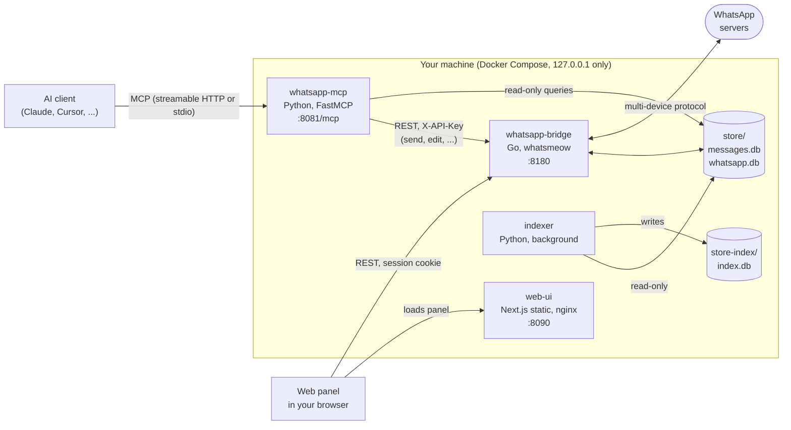

# Architecture

WhatsApp MCP connects an AI client to your WhatsApp account through the WhatsApp Web multi-device protocol
(a linked device, like WhatsApp Web), and exposes it as [Model Context Protocol](https://modelcontextprotocol.io) tools.

## Components

| Component | Directory | Role |
|-----------|-----------|------|
| **Bridge** | [`whatsapp-bridge/`](../whatsapp-bridge) | The only process that talks to WhatsApp. Handles pairing, reconnects, incoming messages and history sync, media download, webhooks and the REST API. Owns `messages.db` and `whatsapp.db`. Also holds the panel's login sessions. |
| **MCP server** | [`whatsapp-mcp-server/`](../whatsapp-mcp-server) | Turns bridge and database capabilities into MCP tools. Reads messages and contacts straight from SQLite; asks the bridge to perform actions (send, edit, react, ...). |
| **Search indexer** | [`whatsapp-mcp-server/search/`](../whatsapp-mcp-server/search) | Background service that reads `messages.db` read-only and maintains a local keyword-search index. Not yet exposed as MCP tools. See [search.md](search.md). |
| **Web panel** | [`whatsapp-web-ui/`](../whatsapp-web-ui) | Static Next.js app served by nginx. Login, device pairing, sync status, active sessions and webhook management. It calls the bridge API directly from the browser. |

## Data flow

**Reading.** WhatsApp pushes messages to the bridge, which writes them to `messages.db` (SQLite, WAL mode). The MCP server reads
that file directly, so reads never depend on the bridge being reachable.

**Writing.** The MCP server calls the bridge REST API with `X-API-Key`; the bridge sends the message through WhatsApp.

**History.** When a device is first paired, the bridge asks the phone for history within the configured window. Older messages
of a single chat can be requested later with `request_history`. See [history-sync.md](history-sync.md).

**Webhooks.** The bridge can forward incoming messages to HTTP endpoints, matched by trigger rules and signed with HMAC-SHA256.
See [webhooks.md](webhooks.md).

## Storage

| File | Owner | Contents |
|------|-------|----------|
| `store/messages.db` | Bridge | Chats, messages, nicknames and webhook configuration. See [database.md](database.md). |
| `store/whatsapp.db` | whatsmeow | Device session, encryption keys, synced contacts. **Never edit it.** |
| `store/<chat-jid>/` | Bridge | Downloaded media. |
| `store/mcp_oauth.db` | MCP server | OAuth clients and token digests, only when `MCP_PUBLIC_URL` is set. See [mcp-oauth.md](mcp-oauth.md). |
| `store-index/index.db` | Indexer | Search index: a plain-text copy of message text. See [search.md](search.md). |

Both databases use WAL mode so the MCP server can read while the bridge writes. Everything under `store/` is sensitive.

## Security boundaries

- Every published port is bound to `127.0.0.1`. Services reach each other over the internal `whatsapp_internal` network.
- The bridge API requires `X-API-Key` or a panel session cookie. See [authentication.md](authentication.md) and [SECURITY.md](../SECURITY.md).
- The MCP endpoint is unauthenticated and local-only by default. With `MCP_PUBLIC_URL` set it requires an OAuth 2.1 bearer token; see [mcp-oauth.md](mcp-oauth.md).

## Design principles

WhatsApp MCP follows the Unix philosophy: a solid **transport** layer with small, composable tools.

- **Transport first.** Connection lifecycle, messaging, media, reactions, groups, presence, webhooks and safety gates belong here.
- **Composable tools.** Tools are atomic and return raw, complete data ([response-design.md](response-design.md)); the AI client combines them.
- **Heavy processing stays outside.** Transcription, vector search and summarization are better built as separate services or MCP servers
  that consume `download_media` and `list_messages`, instead of growing the core.
- **Curated surface.** Tools are grouped into toolsets so an agent only sees what it needs. Prefer extending an action-based tool over adding a new one.

## Where to extend

| To add... | Touch |
|-----------|-------|
| A WhatsApp capability | A handler in `whatsapp-bridge/internal/api/handlers.go` and a route in `server.go` |
| An MCP tool | A function in `whatsapp-mcp-server/whatsapp.py`, exposed in `main.py` with `@tool(<toolset>, ...)`, with a test in `tests/test_main_tools.py` |
| A toolset | Add it to `ALL_TOOLSETS` in `main.py` |
| A panel page | `whatsapp-web-ui/src/app/<page>/page.tsx`, calling the bridge through `src/lib/api.ts` |

See [CONTRIBUTING.md](../CONTRIBUTING.md).
