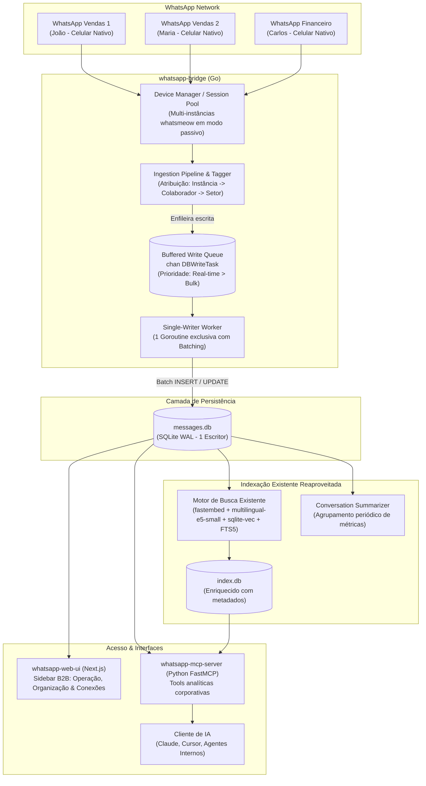

# Plano de Execução: Plataforma de Governança e Inteligência Multi-Setor WhatsApp MCP

Este plano detalha o roteiro técnico e estrutural para transformar o [WhatsApp MCP](file:///media/matheus/SSD5123/PROJETOS/CONECTA/whatsapp-mcp) de um utilitário mono-usuário em uma **plataforma corporativa de centralização de mensagens, auditoria e inteligência contextual via MCP**, com foco estrito em **concorrência sólida, modelagem organizacional, navegação B2B limpa e reaproveitamento do ecossistema existente**.

---

## 1. Premissa Estratégica & Disclaimer de Arquitetura

> [!IMPORTANT]
> **Posicionamento do Produto: Observabilidade e Governança Passiva (Não é Chatbot nem Disparador)**
> 
> * **A Realidade Operacional Corporativa:** Times de vendas, compras e finanças operam no dia a dia com smartphones físicos e o aplicativo nativo do WhatsApp (ou WhatsApp Business). A API Oficial da Meta (Cloud API) é inviável para esse modelo porque **remove o aplicativo do celular do funcionário**, obrigando o atendimento exclusivo por telas de CRM — o que gera atrito e rejeição da equipe.
> * **A Solução por Aparelho Conectado (*Linked Device*):** O uso da biblioteca [whatsmeow](https://github.com/tulir/whatsmeow) permite que cada colaborador continue utilizando seu aparelho físico normalmente, enquanto o `whatsapp-bridge` atua como um espelho de auditoria em segundo plano (idêntico a uma aba de WhatsApp Web aberta).
> * **Perfil de Risco de Banimento Drasticamente Reduzido:**
>   1. **Sem Disparos em Massa:** O sistema não realiza automações ativas de marketing, prospecção fria ou campanhas em lote.
>   2. **Sem Gatilhos de Denúncia (*Spam Reports*):** A comunicação é estritamente humana e orgânica.
>   3. **Comportamento Passivo:** A Bridge atua predominantemente em escuta passiva das mensagens que o próprio servidor da Meta sincroniza para os dispositivos pareados da conta, com telemetria e presença natural (offline por padrão).

---

## 2. Visão Geral da Arquitetura Alvo



---

## 3. Nova Arquitetura de Navegação (Sidebar do Painel Web)

A barra lateral do [whatsapp-web-ui](file:///media/matheus/SSD5123/PROJETOS/CONECTA/whatsapp-mcp/whatsapp-web-ui/src/components/layout/sidebar.tsx) deixa de ser uma lista técnica plana e passa a ser agrupada em 3 blocos hierárquicos corporativos:

```
┌──────────────────────────────────────────────┐
│  WhatsApp MCP Enterprise                     │
│  ● 4 instâncias conectadas                   │
├──────────────────────────────────────────────┤
│  OPERAÇÃO & AUDITORIA                        │
│  📊 Dashboard        (/)                     │
│  💬 Mensagens        (/messages)             │
│  🔍 Auditoria & Busca (/audit)               │
│                                              │
│  ORGANIZAÇÃO                                 │
│  🏢 Setores          (/departments)          │
│  👥 Colaboradores    (/employees)            │
│  📱 Números WhatsApp (/instances)            │
│                                              │
│  CONEXÕES & IA                               │
│  🤖 Clientes MCP     (/mcp-clients)          │
│  ⚡ Webhooks         (/webhooks)             │
├──────────────────────────────────────────────┤
│  ⚙️ Configurações    (/settings)             │
│  👤 Admin / Sair                             │
└──────────────────────────────────────────────┘
```

---

## 4. Fases de Execução Sequenciais

### Fase 0: Fundação de Concorrência & Escrita Resiliente (Single-Writer SQLite)
> **Prioridade Máxima:** Necessária **mesmo para 1 único número**, pois rajadas de mensagens simultâneas em grupos ou conflito entre mensagens em tempo real e History Sync já travam o SQLite atual com `database is locked`.

- [x] **0.1. Implementação do `WriteQueue` e `WriterWorker` em Go**:
  - Criar estrutura `DBWriteTask` contendo a operação SQL (InsertMessage, UpdateChat, LogWebhook), parâmetros e canal opcional de confirmação `done chan error`.
  - Criar fila com canais bufferizados separados em [store.go](file:///media/matheus/SSD5123/PROJETOS/CONECTA/whatsapp-mcp/whatsapp-bridge/internal/database/store.go):
    - `priorityQueue`: para mensagens recebidas/enviadas em tempo real e webhooks imediatos.
    - `bulkQueue`: para History Sync (sincronização de histórico antigo).
  - Criar a goroutine única `startWriterWorker(ctx)` que consome as filas e executa as escritas sequencialmente.
- [x] **0.2. Agrupamento em Lote (*Batching*)**:
  - Fazer o worker drenar até N mensagens acumuladas na fila ou aguardar uma janela de 50ms para gravar todas em uma **única transação** (`BEGIN ... COMMIT`).
  - Reduz dezenas de `fsyncs` lentos por segundo para apenas 1 gravação atômica ultrarrápida.
- [x] **0.3. Adaptação de `StoreMessage`, `StoreChat` e `LogWebhook`**:
  - Refatorar métodos de escrita para submeter tarefas à fila em vez de invocar `store.db.Exec()` diretamente de goroutines concorrentes.

---

### Fase 1: Fundação de Dados e Modelagem Organizacional
**Objetivo:** Estruturar o banco de dados para representar a organização corporativa (Setores, Colaboradores, Instâncias de WhatsApp) e indexar as mensagens com esses metadados.

- [x] **1.1. Criação do Schema Organizacional** (em [store.go](file:///media/matheus/SSD5123/PROJETOS/CONECTA/whatsapp-mcp/whatsapp-bridge/internal/database/store.go)):
  - Tabela `departments`: `id`, `name` (ex: Comercial, Financeiro, Compras), `description`, `created_at`.
  - Tabela `employees`: `id`, `department_id` (FK), `name` (ex: João da Silva), `role` (ex: Vendedor Pleno), `email`, `active`.
  - Tabela `instances`: `id`, `phone_jid` (PK), `employee_id` (FK), `alias`, `status` (connected, pairing, disconnected), `paired_at`, `last_seen_at`.
- [x] **1.2. Migração Idempotente das Tabelas `messages` e `chats`**:
  - Adicionar colunas `instance_jid TEXT REFERENCES instances(phone_jid)` e `is_deleted_remote BOOLEAN DEFAULT 0`.
  - Índices compostos de alta performance: `idx_messages_instance_chat` em `(instance_jid, chat_jid, timestamp DESC)` para permitir filtros instantâneos por setor/colaborador.
- [x] **1.3. Repositório Go de Entidades**:
  - Criar `internal/database/organization.go` com operações CRUD para Departamentos, Colaboradores e Associação de Instâncias.

---

### Fase 2: Motor Multi-Instância na Bridge (Go)
**Objetivo:** Permitir que a Bridge mantenha simultaneamente múltiplos sockets abertos com o WhatsApp em modo passivo, cada um gerando seu próprio QR Code e roteando dados de forma isolada.

- [x] **2.1. Refatoração de `Client` para `InstanceManager`**:
  - Substituir o singleton [NewClientWithConfig](file:///media/matheus/SSD5123/PROJETOS/CONECTA/whatsapp-mcp/whatsapp-bridge/internal/whatsapp/client.go#L70) por um gerenciador `InstanceManager` que suporta um pool de instâncias `map[string]*Client`.
  - Suporte a múltiplos dispositivos no whatsmeow `container.GetAllDevices()`.
- [x] **2.2. Ciclo de Vida Independente por Instância**:
  - Endpoints REST para criação, pareamento de QR Code via SSE/base64, reconexão e desconexão de números individuais.
- [x] **2.3. Pipeline de Ingestão e Tagging de Mensagens**:
  - No handler de eventos, injetar automaticamente o `instance_jid` da conexão correspondente antes de enviar a mensagem para a fila de escrita (`WriteQueue`).
  - Tratar evento `ProtocolMessage_REVOKE` para marcar `is_deleted_remote = 1` sem remover a mensagem física do banco.

---

### Fase 3: Reestruturação da UI e Gestão Visual (`whatsapp-web-ui`)
**Objetivo:** Interface administrativa profissional e intuitiva com a nova navegação B2B em shadcn/ui.

- [x] **3.1. Reestruturação da Sidebar ([sidebar.tsx](file:///media/matheus/SSD5123/PROJETOS/CONECTA/whatsapp-mcp/whatsapp-web-ui/src/components/layout/sidebar.tsx))**:
  - Implementar os 3 grupos: **Operação & Auditoria**, **Organização** e **Conexões & IA**.
  - Indicador de status global no header da sidebar (total de instâncias ativas).
- [x] **3.2. Módulo de Organização (Setores e Colaboradores)**:
  - Tela `/departments`: Cadastro de setores e suas descrições funcionais (contexto semântico para a IA).
  - Tela `/employees`: Gestão de membros da equipe, cargo e vínculo com departamento.
- [x] **3.3. Central de Números WhatsApp (`/instances`)**:
  - Substituição da página única `/pairing` por uma listagem de instâncias com:
    - Status de conexão (Online / Desconectado), nível de bateria e versão.
    - Vínculo direto com o colaborador responsável.
    - Modal de pareamento individual com QR Code gerado sob demanda.
- [x] **3.4. Central de Mensagens e Auditoria (`/messages`)**:
  - Feed unificado de mensagens com busca e indicação de instância conectada.
  - Badge visual de auditoria anti-delete (destaca mensagens apagadas pelo remetente no WhatsApp).

---

### Fase 4: Enriquecimento do Indexador Existente e Resumos Analíticos
> **Nota de Reaproveitamento:** O projeto **já possui** um motor completo de busca semântica e por palavras-chave em [whatsapp-mcp-server/search/](file:///media/matheus/SSD5123/PROJETOS/CONECTA/whatsapp-mcp/whatsapp-mcp-server/search/) utilizando embeddings locais (`fastembed` com `multilingual-e5-small`) e `sqlite-vec` + FTS5. **Não será construído um novo indexador nem adicionado banco vetorial externo.**

- [x] **4.1. Enriquecimento de Metadados no Indexador Existente**:
  - Atualizar o esquema das tabelas `messages_idx` e `chunks` em [index_store.py](file:///media/matheus/SSD5123/PROJETOS/CONECTA/whatsapp-mcp/whatsapp-mcp-server/search/index_store.py) para armazenar os campos `instance_jid` e `is_deleted_remote`.
  - Adaptar o [source.py](file:///media/matheus/SSD5123/PROJETOS/CONECTA/whatsapp-mcp/whatsapp-mcp-server/search/source.py) e o [indexer.py](file:///media/matheus/SSD5123/PROJETOS/CONECTA/whatsapp-mcp/whatsapp-mcp-server/search/indexer.py) para carregar e propagar esses metadados para cada mensagem indexada.

---

### Fase 5: Expansão do MCP Server para Ferramentas Corporativas
**Objetivo:** Capacitar o Agente de IA para responder a perguntas analíticas de negócio com respostas precisas e estruturadas.

- [x] **5.1. Novas Ferramentas Organizacionais no MCP**:
  - `list_departments()`: Retorna setores e objetivos da empresa.
  - `list_employees(department_id=None, query=None)`: Retorna colaboradores, cargos e números vinculados.
  - `resolve_employee(query="João")`: Desambigua colaboradores de vendas/compras para contexto de IA.
  - `list_instances()`: Lista instâncias conectadas e aparelhos corporativos.
  - `get_audit_deleted_messages(chat_jid=None, limit=50)`: Histórico de mensagens que foram apagadas no WhatsApp (anti-delete).

---

### Fase 6: Governança, Compliance e Blindagem Jurídica
- [ ] **6.1. Confirmação de Ativo Corporativo**:
  - Termo formal e flag no cadastro de instâncias atestando que o número é corporativo (blindagem trabalhista e LGPD).
- [ ] **6.2. Auditoria e Política de Retenção**:
  - Mecanismos de anonimização (Art. 18 LGPD) e logs de quem consultou dados de mensagens via MCP.
